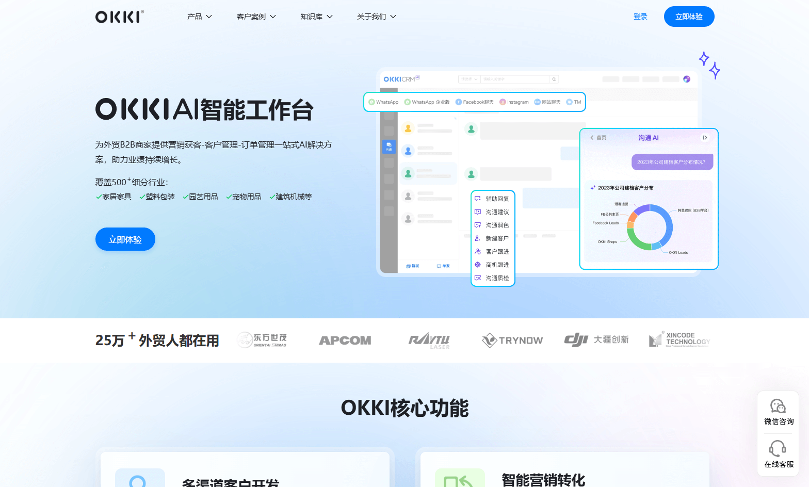
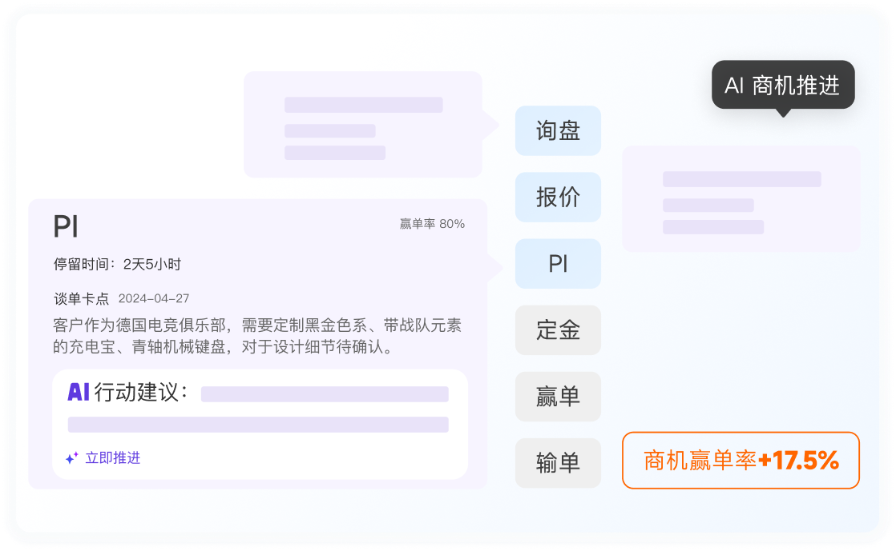
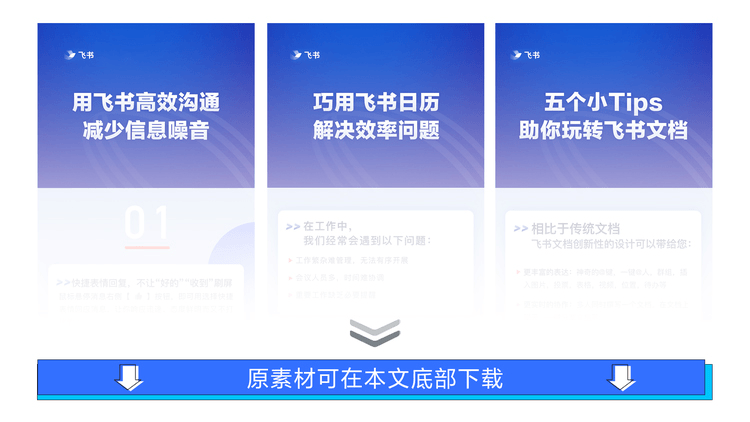
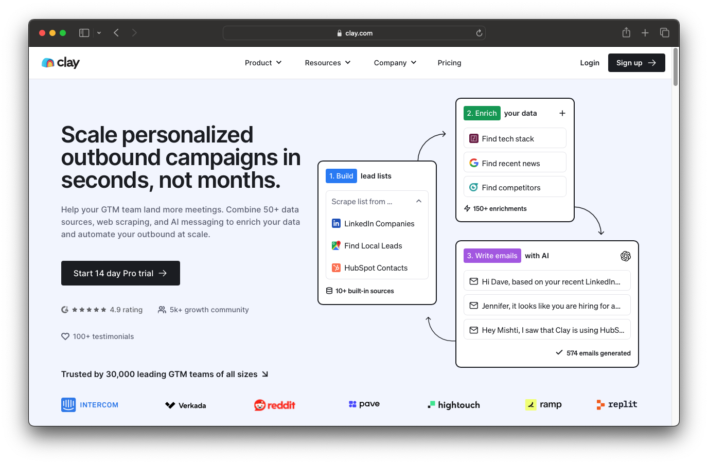

# 黔海小红书视觉对标调研（封面与正文配图）

> 本文只做视觉调研与方向判断，不制作黔海正式图片。  
> 研究目标：回答“一个企业级 AI 出海增长工具，在小红书上应该用什么封面和正文配图，既有点击感又不显得像电商商品广告”。

## 一、调研样本

### 样本 1：OKKI AI 智能工作台

本地参考图：`research/xhs_visual_benchmarks/01-okki-product-ui.png`



**图片用途判断：** 适合作为产品发布页、账号置顶介绍或正文中的“产品全貌图”；不宜未经裁切直接用于小红书封面。

**画面结构：**

- 左侧是产品定位与一句业务价值；
- 右侧使用真实后台界面作为最大视觉主体；
- 用三个局部浮层突出多渠道接入、AI 对话和客户数据；
- 蓝白底、低饱和渐变，品牌感稳定；
- 客户 Logo 和用户规模承担信任证明。

**有效之处：** 第一眼能确定“这是外贸企业工具”，不会被误认为课程、咨询服务或消费品。

**问题：** 直接缩成小红书封面后信息过多，标题可能不够有冲突感；需要从完整官网视觉中只保留一个任务和一个界面动作。

### 样本 2：OKKI AI 商机推进

本地参考图：`research/xhs_visual_benchmarks/02-okki-pipeline.webp`



**图片用途判断：** 这是典型的正文内容图。它只解释一个动作——AI如何推动商机进入下一阶段——非常适合放在图文笔记中段。

**画面结构：**

- 以询盘—报价—PI—定金—赢单的商机阶段为主线；
- 左侧展示一条真实客户上下文；
- AI 建议嵌在工作流里，而不是用机器人形象表达；
- 右下只强调一个结果数字“赢单率提升”；
- 紫色表示 AI，橙色表示商业结果，其他区域保持灰白。

**对黔海最有价值：** 这是“数字员工工具图”的正确方向。AI 应表现为判断、建议、行动和状态变化，而不是发光人形机器人。

### 样本 3：飞书功能海报

本地参考图：`research/xhs_visual_benchmarks/03-feishu-feature-posters.png`



**图片用途判断：** 左右三张均属于封面与首屏图范式；可以研究其标题区、内容区和统一模板，但黔海需要增加真实业务界面，避免变成纯教程海报。

**画面结构：**

- 每张只讲一个具体工作问题；
- 标题占封面上半区，字号大、句子短；
- 下半区放功能界面或操作提示；
- 三张保持统一模板，通过标题区和内容区形成稳定栏目感；
- 不依赖人物和商品照片。

**有效之处：** 适合连续发布、搜索流量和收藏型教程。

**问题：** 如果完全照搬，会显得像帮助中心教程，缺少贵客松参赛产品的创新张力。

### 样本 4：Clay 销售增长工作流

本地参考图：`research/xhs_visual_benchmarks/05-clay-workflow.png`



**图片用途判断：** 同时具备封面和内容图价值。左侧可转化为小红书大标题，右侧三步界面卡可以拆成三张正文图，也可以作为一张工作流总览。

**画面结构：**

- 左侧一句非常明确的结果型主张；
- 右侧把复杂产品简化成三张界面卡：建立名单—补全数据—AI 写邮件；
- 卡片之间用箭头连接，用户不用阅读正文就能理解工作流；
- 不展示完整后台，只展示最能证明价值的界面片段；
- 大面积留白，颜色只用于区分步骤。

**对黔海最有价值：** 黔海也不应该把完整后台截图直接塞进封面，而应把“目标—行动—信号—人工接管”拆成三到四张可读的产品卡。

### 样本 5：11x 数字员工

公开参考：11x 使用大场景摄影、极短口号和企业客户 Logo 建立品牌记忆，代表句是“Digital workers, Human results”。

**画面结构：**

- 一张强视觉大图承担情绪；
- 一句极短产品立场承担定位；
- 不在同一画面解释功能；
- 企业 Logo 和案例数据提供可信度。

**可借鉴：** 适合账号置顶宣言、赛事发布或品牌片封面。

**不适合直接用于两篇业务拆解帖：** 品牌感强但信息密度低，无法单独解释展会线索或抹茶渠道任务。

### 样本 6：小红书官方企业产品手册封面

小红书官方营销学习平台的企业产品手册采用大号黑体、蓝色色块和少量红色品牌元素，标题信息几乎占据整个封面。

**说明：** 在小红书信息流里，工具类内容首先需要“文字两秒可读”，视觉装饰必须让位于标题。工具商不必依赖人物或产品棚拍，也可以靠强排版获得点击。

## 二、调研得到的四种封面类型

### 类型 A：痛点冲突型

**结构：** 大标题＋一个关键数字／结果＋一块局部产品界面。

**适用选题：** 展会线索只剩 Excel、客户无人跟进、内容与商机脱节。

**建议比例：**

- 标题 45%；
- 产品界面 40%；
- 品牌与栏目标签 15%。

**正确示例逻辑：**

> 展会带回 300 条线索  
> 30 天后，还剩多少？  
> 旁边展示“待跟进客户队列＋最后行动时间”。

**避免：** 用一个疲惫业务员和一桌名片承担整张封面。那只能表达焦虑，不能证明工具价值。

### 类型 B：任务推演型

**结构：** 经营任务卡＋三个连续动作卡＋一个人工接管节点。

**适用选题：** 贵州抹茶如何找到马来西亚渠道商、一个品牌如何进入目标市场。

**正确示例逻辑：**

> 左上：产品／国家／目标客户  
> 中间：目标账户—内容触达—采购信号  
> 右下：样品／报价触发人工接管

**避免：** 抹茶包装、茶园或马来西亚城市风景占据封面。它们可以成为任务卡里的小缩略图，不应成为主角。

### 类型 C：界面证据型

**结构：** 一句判断＋一张放大的产品界面＋三个标注点。

**适用选题：** 产品能力发布、数字员工怎样工作、人工怎样接管。

**正确示例逻辑：**

> 标题：“真正的数字员工，必须知道什么时候停手”  
> 主图：行动时间线／审批异常页面  
> 标注：预算越界、报价请求、高价值客户

### 类型 D：品牌宣言型

**结构：** 强场景摄影或抽象品牌图＋一句极短立场＋少量信任信息。

**适用选题：** 账号首篇、产品发布、赛事节点、置顶品牌片。

**正确示例逻辑：**

> 把标准增长交给 AI  
> 把商业突破留给人

**限制：** 不承担复杂功能解释，每 6—8 篇最多使用一次。

## 三、正文配图的正确组成

### 1. 产品界面页：占 50%—60%

正文配图的主角应是黔海原型中的真实产品对象：

- 经营任务卡；
- 目标账户列表；
- 数字员工行动时间线；
- 内容版本与投流状态；
- 客户信号和意向评分；
- 待审批与人工接管；
- 内容—对话—商机—收入归因。

每页只放一个局部界面，并加 1—3 个短标注。不要把完整后台缩小到手机屏幕里。

### 2. 业务流程页：占 20%—30%

参考 Clay 的卡片式流程，不使用传统咨询公司式的复杂流程图。

推荐形式：

```text
经营目标
   ↓
目标账户与内容动作
   ↓
客户采购信号
   ↓
AI 常规承接／人工关键接管
```

每个步骤最好对应产品里的真实对象和页面，而不是抽象图标。

### 3. 场景照片页：不超过 15%

只用于建立真实上下文：

- 展会现场或企业会议；
- 产品资料、检测报告与样品；
- 外贸团队看经营任务；
- 园区或广电项目团队协作。

照片上必须叠加产品任务或数据卡，不能单独成为连续内页。

### 4. 结论／互动页：约 10%

使用强排版和一个具体问题，不使用“欢迎联系我们”“点击咨询”等硬广式收尾。

## 三点五、封面图与正文内容图对照

| 图片类型 | 视觉任务 | 应该出现 | 不应该出现 | 对标样本 |
|---|---|---|---|---|
| 封面图 | 两秒内让目标用户认出自己的问题 | 12—20字标题、一个关键数字或反差词、一块局部产品界面 | 完整后台、长段功能说明、商品棚拍占满画面 | 飞书功能海报、Clay左侧标题结构 |
| 首屏问题图 | 把标题进一步变成真实工作场景 | 超时客户、待处理任务、经营目标或异常状态 | 空泛行业观点、无数据的情绪照片 | OKKI客户与工作台结构 |
| 产品证据图 | 证明数字员工确实做了动作 | AI判断、动作依据、执行状态、结果变化 | 机器人形象、只有“AI生成中”的装饰界面 | OKKI商机推进 |
| 流程内容图 | 让复杂闭环一眼可理解 | 三至四张界面卡、箭头、真实业务字段 | 七八层复杂流程、咨询公司式密集图 | Clay三步工作流 |
| 场景配图 | 交代产业和人物上下文 | 展会、企业会议、产品资料、样品缩略图 | 把抹茶或其他商品拍成消费品广告 | 只作为辅助，无单一主对标 |
| 结果图 | 连接内容动作和经营结果 | 有效账户、合格询盘、样品、报价、预计商机 | 只展示播放量、点赞量或虚构成交额 | OKKI商机阶段与结果提示 |

### 封面图参考组合


黔海应借鉴其“大标题在上、信息在下”的阅读顺序，但下半区替换为黔海的真实任务卡、客户队列或行动时间线。

### 正文内容图参考组合


两类内容图分别解决不同问题：OKKI证明“一个具体动作如何影响商机”，Clay证明“多个动作怎样形成连续流程”。黔海的正文应同时需要这两类图，而不是连续使用纯文字卡。

## 四、适合黔海的视觉语言

### 1. 画面主角

优先顺序：

1. 客户账户、商机和行动；
2. 数字员工判断和执行记录；
3. 人工审批、异常和接管；
4. 行业产品与目标市场；
5. 人物和场景照片。

### 2. 色彩

建议采用：深海军蓝／墨绿作为企业可信底色，亮蓝表示自动执行，橙色表示审批与人工接管，绿色表示完成和商机结果。

不建议采用：整套电商抹茶绿、粉紫 AI 渐变、霓虹蓝机器人、过多玻璃拟态。

### 3. 字体与信息层级

- 封面主标题控制在 12—20 个汉字；
- 只强调一个数字或一个反差词；
- 副标题最多两行；
- 品牌 Logo 不超过画面面积的 5%；
- 每张正文图只表达一个判断或一个动作。

### 4. 产品截图处理

- 截取局部，不使用完整浏览器窗口；
- 放大真实业务字段，如国家、客户类型、采购信号、预算、接管原因；
- 通过箭头、框选和颜色突出行动变化；
- 模拟数据必须统一标注“Demo 数据”；
- 不为了好看虚构无法在原型中找到的功能。

## 五、两篇笔记的视觉对标结论

### 选题一：展会线索

**封面类型：** A 痛点冲突型。

**封面主视觉：** 待跟进客户队列／跟进超时界面，而不是名片桌面照片。

**正文建议：**

1. 痛点标题＋超时客户队列；
2. 300 条联系人进入系统的列表；
3. 采购商／经销商／普通访客分层；
4. 数字员工自动补全和跟进时间线；
5. MOQ、认证、样品等客户信号；
6. 报价或代理请求触发人工接管；
7. 从联系人到样品／报价／商机的结果漏斗；
8. 互动问题。

### 选题二：贵州抹茶与马来西亚渠道

**封面类型：** B 任务推演型。

**封面主视觉：** 黔海经营任务卡，产品缩略图只占任务卡的一小块。

**正文建议：**

1. 经营任务：贵州抹茶／马来西亚／渠道型 B2B；
2. 目标渠道商账户列表；
3. 采购、研发、渠道老板三类角色；
4. 三类角色对应的内容版本；
5. 分发与小额投流行动记录；
6. 评论、私信或表单里的采购信号；
7. 样品／报价请求与人工接管；
8. 内容到商机的归因链和互动问题。

## 六、推荐选择

黔海不应固定采用一种封面，而应建立一个三模板系统：

1. **痛点冲突模板：** 用于展会、获客、跟进和归因问题；
2. **经营任务模板：** 用于不同产业、产品和国家的出海推演；
3. **产品证据模板：** 用于数字员工行动、权限、审批和人工接管。

三种模板共用字体、颜色、标注方式和页码系统，既保持账号统一，又避免每篇都像一张软件广告。

## 七、当前结论

> **黔海的封面不是“一个行业产品＋一张漂亮照片”，而是“一个具体经营问题＋一块能证明产品如何行动的界面”。**

视觉上最值得组合借鉴的是：

- 飞书的大标题与单问题封面；
- Clay 的三步界面卡和流程可视化；
- OKKI 的外贸业务字段、客户上下文和商机阶段；
- 11x 的极短数字员工立场，但只用于品牌宣言。
